# Mise En Place Client

Ce guide décrit le parcours complet pour installer AI Second Brain depuis l'interface web, sans commande locale.

## Prérequis

- Un compte GitHub avec accès au dépôt AI Second Brain.
- Un compte Vercel.
- Un accès ChatGPT avec la page des plugins personnels.
- Redis/Upstash configuré sur Vercel. C'est requis pour un déploiement Vercel fonctionnel.

## 1. Créer Le Projet Vercel

1. Ouvrir Vercel et créer un nouveau projet depuis GitHub.
2. Sélectionner le dépôt `SixCamille/ai-second-brain`.
3. Choisir la team Vercel qui hébergera le cerveau.
4. Garder le nom de projet proposé ou choisir un nom clair.
5. Garder le preset `Other`.
6. Garder le root directory sur `./`.
7. Cliquer sur `Deploy`.

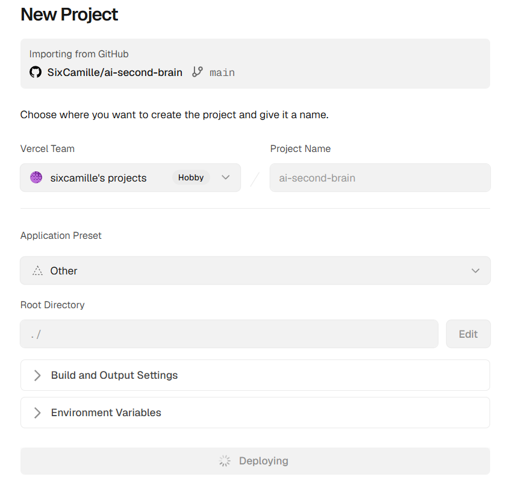

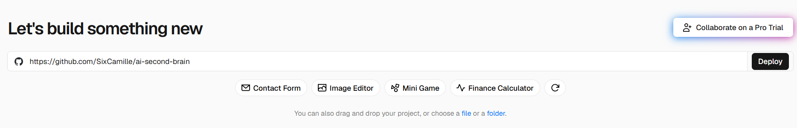

Vercel crée un premier déploiement et affiche une page de confirmation.

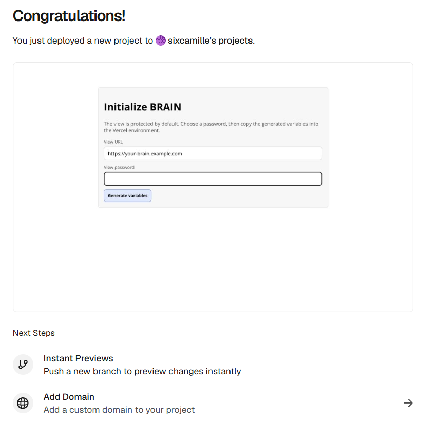

## 2. Installer Redis Sur Vercel

Redis est obligatoire sur Vercel. Sans Redis, AI Second Brain ne peut pas écrire les objets, événements, instructions utilisateur et configurations de types.

1. Depuis l'écran d'initialisation AI Second Brain, cliquer sur `Install Upstash Redis on Vercel`.
2. Sur la page Upstash Marketplace, choisir la même team Vercel que celle du projet.
3. Cliquer sur `Continue`.
4. Attacher Upstash au projet AI Second Brain.
5. Vérifier que Vercel ajoute les variables Redis au projet.

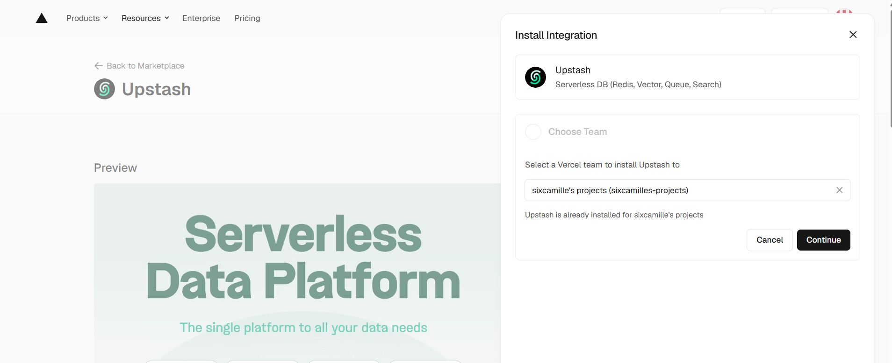

Variables acceptées :

```text
UPSTASH_REDIS_REST_URL
UPSTASH_REDIS_REST_TOKEN
```

ou :

```text
KV_REST_API_URL
KV_REST_API_TOKEN
```

## 3. Générer Les Variables De La Vue

1. Ouvrir l'URL Vercel du projet.
2. Sur l'écran `Initialize AI Second Brain`, vérifier que `View URL` contient l'URL publique du déploiement.
3. Choisir un mot de passe pour protéger la vue.
4. Cliquer sur `Generate variables`.
5. Cliquer sur `Copy`.

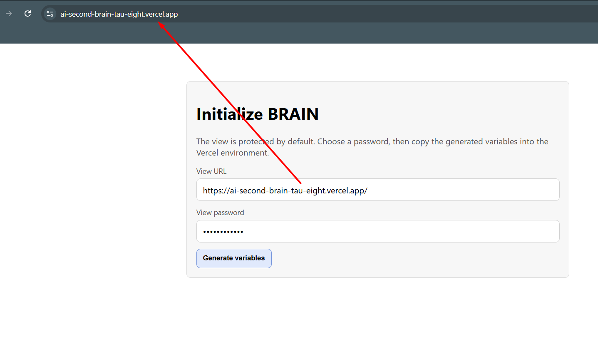

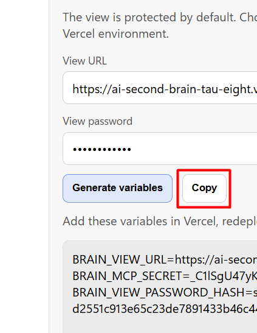

Le bloc copié contient :

```text
BRAIN_VIEW_URL=...
BRAIN_MCP_SECRET=...
BRAIN_VIEW_PASSWORD_HASH=...
```

## 4. Ajouter Les Variables Dans Vercel

1. Ouvrir le projet dans Vercel.
2. Aller dans `Settings` puis `Environment Variables`.
3. Ajouter les trois variables générées :
   - `BRAIN_VIEW_URL`
   - `BRAIN_MCP_SECRET`
   - `BRAIN_VIEW_PASSWORD_HASH`
4. Les ajouter à l'environnement qui sert l'URL utilisée, généralement `Production`.
5. Vérifier que les variables Redis sont aussi présentes sur ce même environnement.

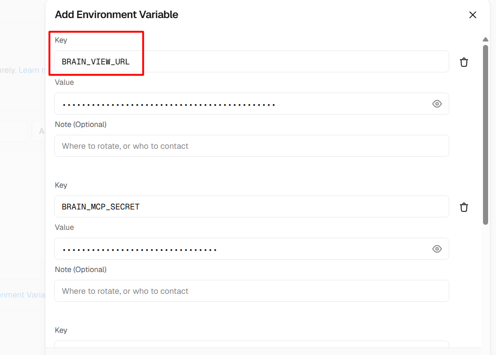

## 5. Redéployer

Les nouvelles variables ne sont pas visibles par un déploiement déjà créé.

1. Dans Vercel, ouvrir le dernier déploiement ou la page du projet.
2. Cliquer sur `Redeploy`.
3. Choisir l'environnement `Production`.
4. Lancer le redéploiement.

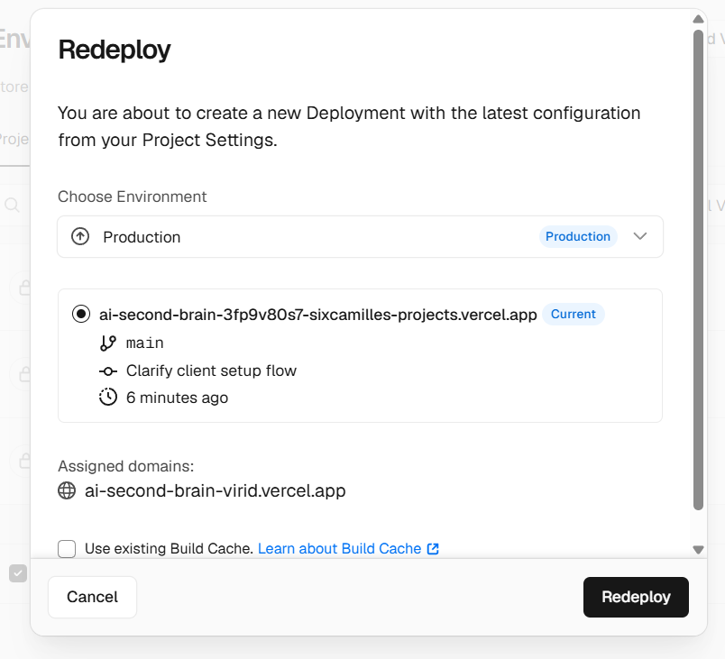

Après le redéploiement, rouvrir l'URL publique.

Résultat attendu :

- Avant les variables de vue : écran d'initialisation.
- Après les variables de vue et le redéploiement : écran de login.
- Après login : graphe AI Second Brain, vide au départ.

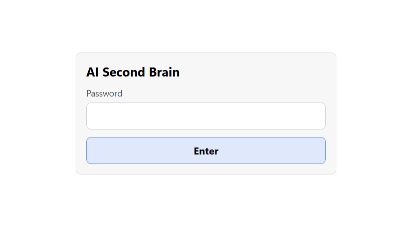

## 6. Récupérer L'URL MCP

1. Se connecter à la vue avec le mot de passe choisi.
2. Cliquer sur le bouton `MCP`.
3. Copier la valeur `MCP URL`.

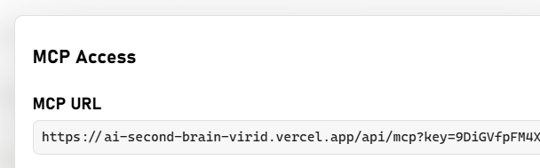

Cette URL ressemble à :

```text
https://<projet>.vercel.app/api/mcp?key=<secret>
```

## 7. Ajouter Le Plugin Dans ChatGPT

1. Ouvrir la page `Plugins` dans ChatGPT.
2. Aller dans l'onglet `Personnel`.
3. Cliquer sur le bouton `+`.

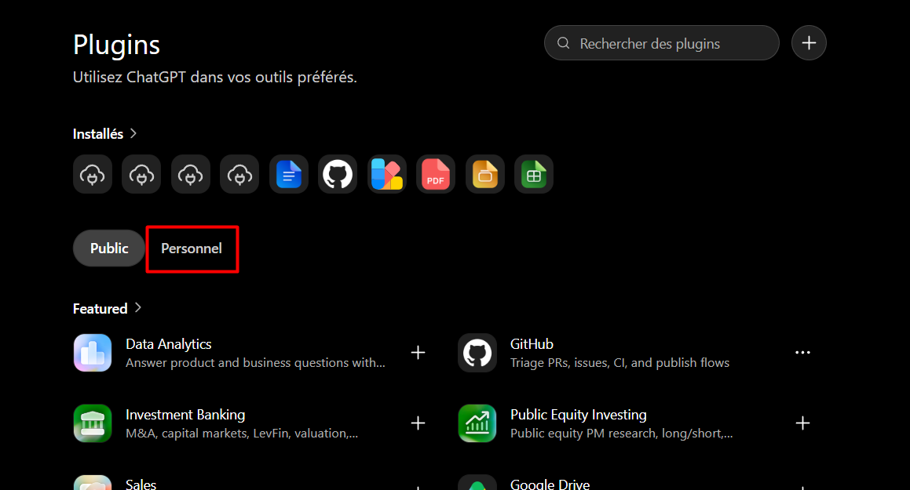

4. Remplir le formulaire :
   - `Nom` : `AI Second Brain`
   - `Description` : une description courte, par exemple `Mon second cerveau pour créer des noeuds et organiser les idées`
   - `Connexion` : `URL du serveur`
   - URL : coller la `MCP URL` copiée depuis la vue
   - `Authentification` : `Aucune authentification`
5. Lire l'avertissement sur les serveurs MCP personnalisés.
6. Cocher la confirmation si vous acceptez le risque.
7. Enregistrer le plugin.

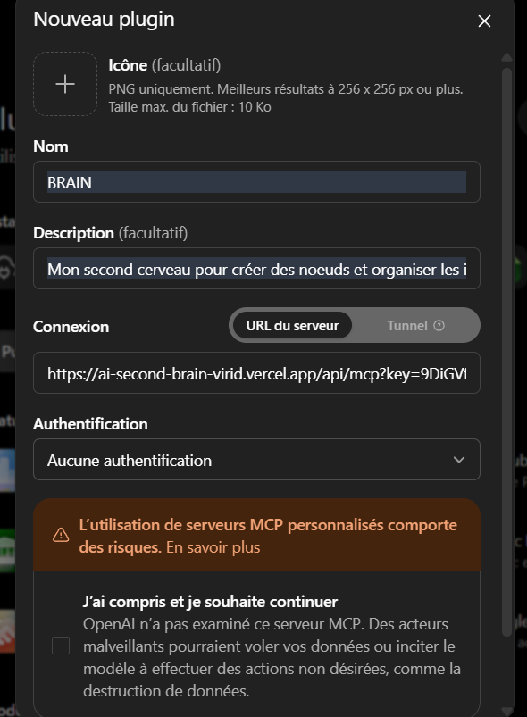

Le secret MCP est déjà dans l'URL sous forme de paramètre `key`, donc il ne faut pas configurer une authentification séparée dans ChatGPT.

## 8. Premier Usage

Dans ChatGPT, sélectionner le plugin personnel `AI Second Brain`, puis demander une première initialisation.

Exemple :

```text
Utilise AI Second Brain. Lis les règles, puis si le cerveau est vide, suis empty_brain.md et pose-moi les questions de départ.
```

L'agent doit ensuite :

1. appeler `get_rules`;
2. appeler `get_rule` avec `empty_brain.md` si le cerveau est vide;
3. poser les questions de démarrage;
4. créer les premiers noeuds uniquement à partir des réponses utilisateur.

## Dépannage

Si l'écran d'initialisation revient après ajout des variables, le déploiement ouvert ne voit pas encore `BRAIN_VIEW_PASSWORD_HASH`. Vérifier l'environnement Vercel utilisé, puis redéployer.

Si une page indique que Redis est requis, installer Upstash Redis sur le même projet Vercel, vérifier les variables Redis, puis redéployer.

Si le plugin ChatGPT ne se connecte pas, recopier l'URL MCP depuis le bouton `MCP` de la vue et vérifier que l'URL contient bien `?key=...`.
